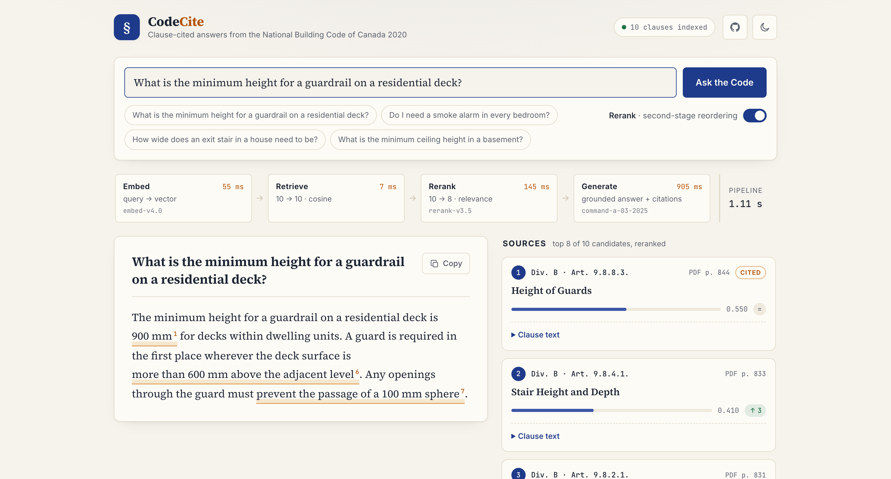

# CodeCite

Citation-grounded RAG over the **National Building Code of Canada 2020**, built on the full Cohere stack: **Embed v4** for retrieval, **Rerank 3.5** for precision, **Command A** for grounded generation with clause-level citations.

Ask it a building-code question and it answers from the Code itself, citing the exact Articles and Sentences:

```
$ codecite ask "What is the minimum height for a guardrail on a residential deck?"

The minimum height for a guardrail on a residential deck is 900 mm according to
Sentence 9.8.8.3.(2), which states that "All guards within dwelling units or
within houses with a secondary suite including their common spaces shall be not
less than 900 mm high." However, if the walking surface served by the guard is
not more than 1 800 mm above the finished ground level, the minimum height is
also 900 mm as per Sentence 9.8.8.3.(3). ...

--- Citations ---
  Division B, Article 9.8.8.3. (Height of Guards (See Note A-9.8.8.3.)), PDF p. 844
  Division B, Note A-9.8.8.1. (Required Guards), PDF p. 1343
```

The same pipeline drives a web UI (`codecite serve`) where the citations become clickable highlights tied to their source clauses and every pipeline stage reports its latency:

<picture>
  <source media="(prefers-color-scheme: dark)" srcset="docs/web-dark.png">
  
</picture>

<sub>Screenshots show the synthetic dev-fixture corpus; a real index answers from all ~3,000 NBC clauses.</sub>

## Why this exists

Building codes are exactly the kind of document RAG is hard on: 1,500 pages, deeply nested legal numbering (Division B → Part 9 → Section 9.8 → Subsection 9.8.8 → Article 9.8.8.3 → Sentence (2)), two-column typesetting, cross-references everywhere, and answers that must be *exact* — "not less than 1 070 mm" is a legal requirement, not a vibe. As a civil engineering student I wanted the reference tool I wish existed, and it doubles as a testbed for measuring what each stage of a retrieval pipeline actually contributes.

## Architecture

```
NBC 2020 PDF (1,528 pages)
   │  column-aware extraction (PyMuPDF text blocks sorted into reading order)
   ▼
clause parser  ──  Division / Part / Section / Subsection / Article hierarchy,
   │               appendix notes (A-x.x.x.x), TOC + attribution-table filtering
   ▼
~3,000 structure-aware chunks  ──  one chunk per Article, each prefixed with a
   │                               context header carrying its full clause path
   ▼
Cohere Embed v4 (search_document) ──► local vector index (NumPy, exact cosine)
                                      or Postgres + pgvector (optional backend)

query ──► Embed v4 (search_query) ──► top-30 dense candidates
                 ──► Cohere Rerank 3.5 ──► top-8
                 ──► Command A with documents= ──► answer + span-level citations
                       mapped back to clause IDs and PDF pages

served two ways: `codecite ask` (CLI) and `codecite serve` (FastAPI JSON API
                 hosting the React/TypeScript UI in web/)
```

### Design decisions worth discussing

- **Chunk = Article, not fixed-size windows.** Clause boundaries are the citation boundaries. A 512-token window that straddles Articles 9.8.8.2 and 9.8.8.3 can't be cited honestly; a chunk that *is* Article 9.8.8.3 can.
- **Context headers close the vocabulary gap.** A user asks about "deck railing height"; Sentence text says "1 070 mm high" and only the headings say "Guards". Prepending `Division B, Part 9 (Housing and Small Buildings), … Article 9.8.8.3 (Height of Guards)` to the embedded text puts the heading vocabulary into the vector.
- **The parser has to fight the PDF.** Real problems handled: two-column reading order, running headers/footers, a copyright watermark mid-page, per-Part tables of contents whose entries look exactly like article headings (filtered by dot leaders), attribution tables that re-list every article number with objective codes (would have shadowed every real article — skipped), and a table cell that reads "Appendix C, °C" and must not be mistaken for the start of Appendix C.
- **Duplicate clause numbers are real.** Division A, B and C each have a Part 1, so "1.4.1.2." is ambiguous — every chunk is keyed by division + clause.
- **Known limitation: tables.** Numeric table cells (span tables, snow-load tables) scramble under text extraction. Table *prose* (notes, conditions) survives and lands in the right chunk; cell-accurate table QA would need a layout-aware table extractor.

## Eval: what does each stage actually buy?

`eval/questions.jsonl` holds 30 hand-written question → answer → gold-clause triples, each verified against the extracted corpus (the answer's key quantity literally appears in the gold chunk). The harness retrieves the same 30 dense candidates per question and scores the ranking with and without Rerank — same pool, same k, so the delta is attributable to Rerank alone.

```
python eval/run_eval.py
```

Measured results (Embed v4 / Rerank 3.5, 30 questions):

| Metric | Embed only | + Rerank (header + body) | + Rerank (body only, ablation) |
|---|---|---|---|
| hit@1 | **60.0%** | 53.3% | 33.3% |
| hit@3 | **90.0%** | 90.0% | 80.0% |
| hit@5 | **93.3%** | 90.0% | 86.7% |
| MRR | **0.760** | 0.709 | 0.579 |

Two findings I did not expect when I built this:

1. **The context headers are the workhorse.** Stripping the clause-path header from what Rerank reads costs 20 points of hit@1 (53.3% → 33.3%). Structure-aware chunking isn't a nicety here — it's most of the retrieval quality, for the reranker as much as for the embedder.
2. **Rerank did not lift this pipeline — dense retrieval had already saturated it.** With headers in place, Embed v4 alone puts the gold clause at rank 1 for 60% of questions and in the top 3 for 90%; Rerank shuffles a few rank-1 hits down and a few rank-2 hits up, netting slightly negative. The honest conclusion: a second-stage reranker earns its keep when the first stage is weak or the candidate pool is noisy; over ~3,000 well-structured chunks with vocabulary-rich headers, first-stage retrieval left it little to fix. Per-question ranks are in [eval/results.md](eval/results.md).

## Web UI

`codecite serve` hosts a React + TypeScript front end (Vite, no UI framework) over the same pipeline:

- **Citations you can touch.** Span-level citations render as highlighted spans in the answer; clicking one scrolls to the supporting clause, and each source card highlights back every statement it supports.
- **The pipeline is legible.** Embed → retrieve → rerank → generate as a live trace with per-stage latency and model names, plus a Rerank toggle — the eval table's ablation, interactive.
- **Rank movement.** Each source shows where dense retrieval ranked it versus where Rerank placed it (`↑3`, `↓1`, `=`), so you can watch the second stage earn (or not earn) its keep.

```bash
pip install -e .[web]
cd web && npm install && npm run build && cd ..
codecite serve                    # http://127.0.0.1:8000
```

For frontend work without an API key or index, `python scripts/dev_server.py` runs the real API over a small synthetic fixture corpus (paraphrased placeholder text, not the Code), and `cd web && npm run dev` proxies to it with hot reload.

### Hosted demo

A static build of the UI is published to GitHub Pages at **https://nishantshah0.github.io/codecite/** by [`.github/workflows/pages.yml`](.github/workflows/pages.yml) on every push to `main`. Pages cannot run the FastAPI backend (and the Code text is not redistributable), so the workflow builds with `VITE_DEMO=1`: `scripts/export_demo.py` records the fixture API's responses — the same synthetic corpus the dev server uses, with and without Rerank — into `web/public/demo/`, and the demo build answers from those snapshots instead of `/api`. It shows the citation UI, rank movement and pipeline trace; it does not answer from the Code.

To host the UI statically against a real, separately deployed API, build with `VITE_API_BASE=https://your-api.example.com` (the API would also need CORS enabled for the Pages origin). `VITE_BASE_PATH` sets the public path when serving under a sub-path.

## Quickstart

```bash
git clone https://github.com/nishantshah0/codecite && cd codecite
pip install -e .[dev]

# 1. get the corpus (free from the Government of Canada; ~24 MB)
python scripts/download_nbc.py

# 2. get a free trial key at https://dashboard.cohere.com/api-keys
export COHERE_API_KEY=...        # Windows: setx COHERE_API_KEY "..."

# 3. parse, chunk, embed, index (~3,000 chunks, ~35 embed calls)
codecite ingest

# 4. ask questions
codecite ask "How wide does an exit stair in a house need to be?"
codecite ask "Do I need a smoke alarm in every bedroom?" --show-hits
codecite ask "..." --no-rerank    # feel the difference yourself

# 5. reproduce the eval table
python eval/run_eval.py
```

Optional Postgres/pgvector backend (e.g. Supabase): `pip install -e .[pg]` and set `CODECITE_DATABASE_URL` — the same `ingest`/`ask` commands then index and search in Postgres.

## Tests

`pytest` runs fully offline: extraction is tested against synthetic two-column PDFs generated in-test, the parser against constructed page text covering every filtering rule above, and the retrieve→rerank→generate pipeline against a fake Cohere client — plus integrity checks on the eval set and the JSON API exercised through FastAPI's test client. The frontend's citation-span segmentation (offsets, fallback search, overlap handling) is covered by Vitest in `web/`. CI runs both suites on every push.

## Legal

The NBC 2020 is © NRC; it is free to access but not redistributable, so this repo ships the *pipeline*, not the Code — the download script fetches the official PDF from publications.gc.ca. This tool is a study aid, not a substitute for the Code or professional judgment; verify anything that matters against the official text and your province's amendments (Ontario, Quebec, BC and Alberta administer their own variants).
